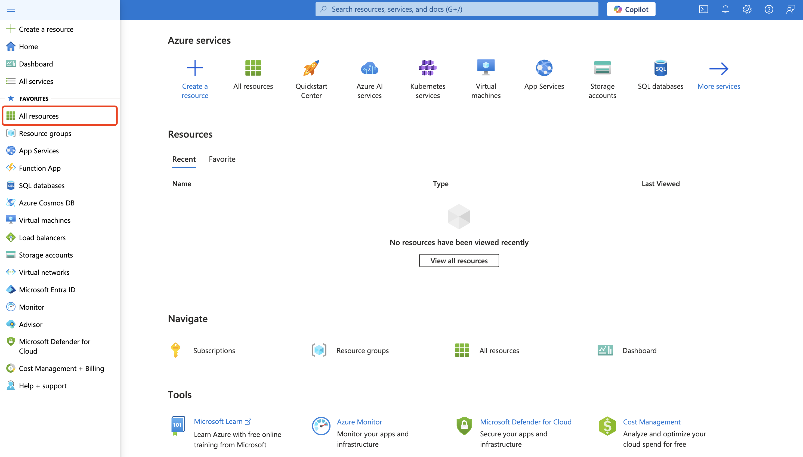
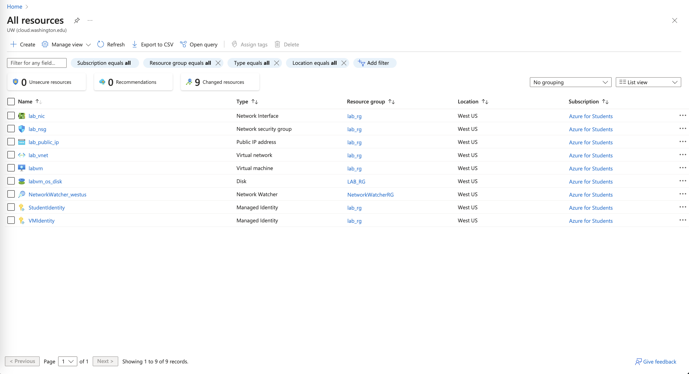
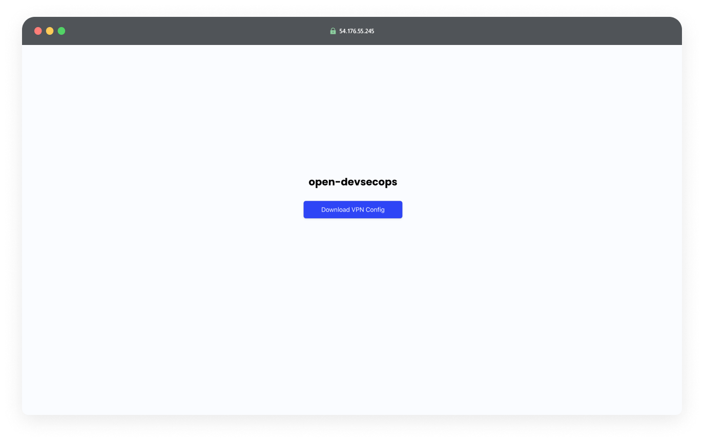
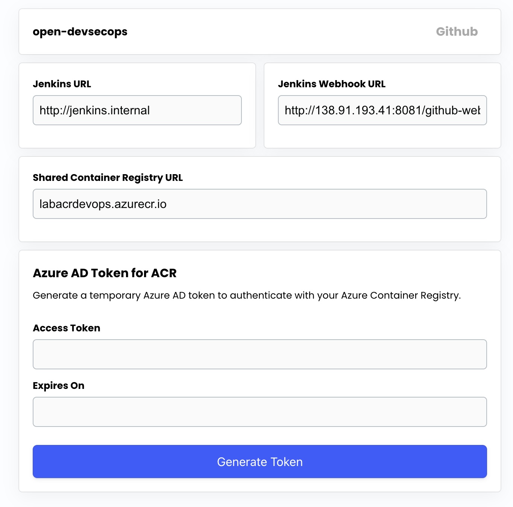
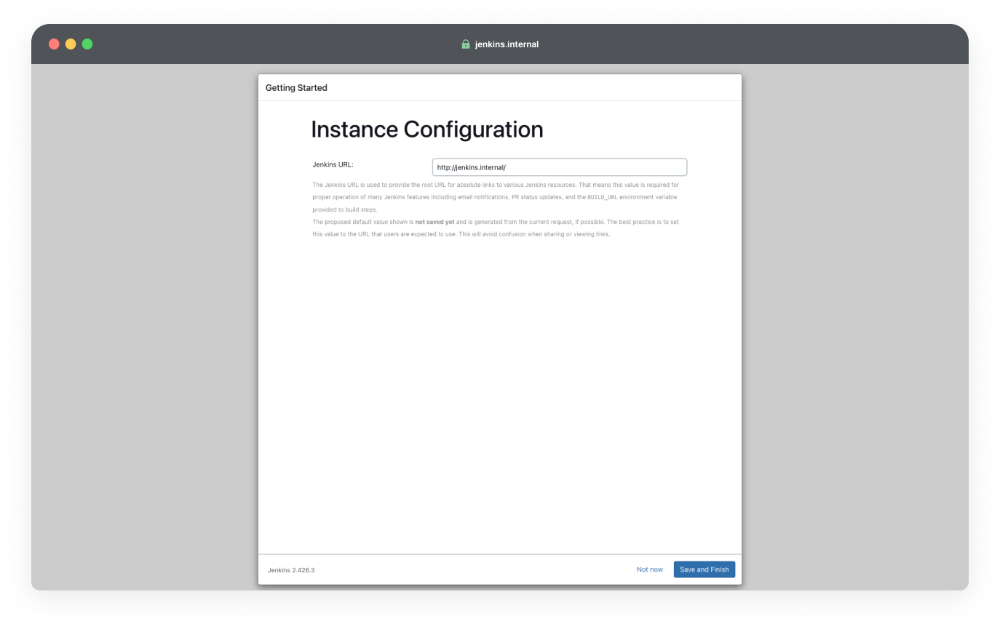
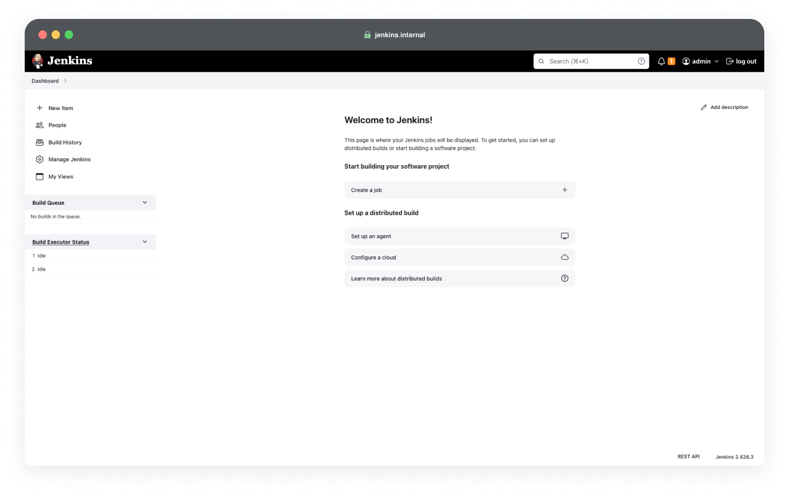
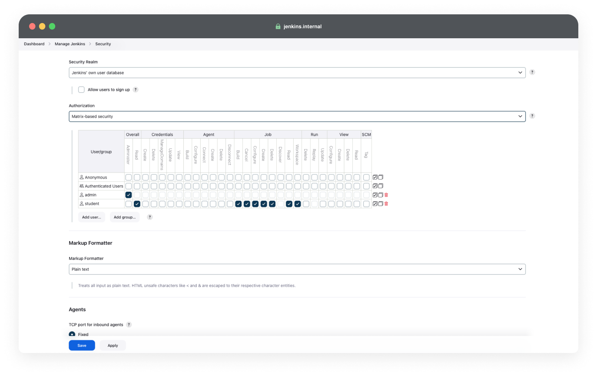

# DevOps & DevSecOps Lab Infrastructure Setup Guide on Azure

## Introduction

This guide provides detailed instructions for setting up the necessary infrastructure on **Microsoft Azure** to support the DevOps and DevSecOps labs in our curriculum. By following this guide, educators and learners will be able to prepare a robust environment for hands-on practice with continuous integration and continuous delivery using Azure services.

### Estimated Cost Summary

| User Type              | Approx. Daily Cost | Notes                            |
|------------------------| ----------------- | -------------------------------- |
| **Educators/Students** | $0/day            | Within free tier and $100 credit |
| **Non-Students**       | ~$0.5/day         | For always-on usage              |

*Prices may vary based on Azure region, VM type, or additional usage (e.g., outbound data, diagnostics, backup). Always check the [Azure Pricing Calculator](https://azure.microsoft.com/en-us/pricing/calculator/) for the most accurate estimates.


## Prerequisites

Before setting up the infrastructure, ensure that you have the following tools installed and configured on your machine. These tools are necessary for interacting with Azure services and for deploying and managing the infrastructure.

### Software Requirements

| Name             | Purpose                                                              | Installation Guide                                                                                                                  |
| ---------------- | -------------------------------------------------------------------- | ----------------------------------------------------------------------------------------------------------------------------------- |
| Azure CLI        | To interact with Microsoft Azure Services.                           | [How to install the Azure CLI](https://learn.microsoft.com/en-us/cli/azure/install-azure-cli){: .btn .btn-purple .btn-fill }        |
| Terraform        | To provision Azure Infrastructure consistently and programmatically. | [Install Terraform](https://developer.hashicorp.com/terraform/tutorials/aws-get-started/install-cli){: .btn .btn-purple .btn-fill } |
| Git              | To clone the infrastructure scripts.                                 | [Getting Started - Installing Git](https://git-scm.com/book/en/v2/Getting-Started-Installing-Git){: .btn .btn-purple .btn-fill }    |
| WireGuard Client | To access internal services.                                         | [WireGuard Installation](https://www.wireguard.com/install/){: .btn .btn-purple .btn-fill }                                         |

### Other Requirements

- **Active Azure Account**: You need an active Microsoft Azure account to provision Azure services. You will be billed according to the resources you use during the labs. 
  
  If you are an educator or student, you can activate your Azure for Students account to start using your 100 USD free credit which valid for up to 12 months, without needing a credit card. 

- **Terminal / Linux Shell Access**: A terminal environment (such as Bash, Zsh, or Windows Subsystem for Linux) is required to run CLI commands, Terraform scripts, and Git operations.
    - On Windows, it's recommended to install [Windows Subsystem for Linux (WSL)](https://learn.microsoft.com/en-us/windows/wsl/install).
    - On macOS and Linux, a native terminal is already available.

- **IDE**: You can use any code editor or IDE of your choice. Recommended options include:
  - [Visual Studio Code](https://code.visualstudio.com/)
  - [JetBrains IDEs](https://www.jetbrains.com/#for-developers)

### Configure the Azure CLI and Login Azure Account

1. Open your terminal.

2. Log in to Azure:

   ```bash
   az login
   ```
   
3. Get your Azure subscription ID:

   ```bash
   az account show --query id --output tsv

   Outputs:
   xxxxxxxx-xxxx-xxxx-xxxx-xxxxxxxxxxxx
   ```
   
<hr>

## Setting Up The Infrastructure With Terraform

With the Azure CLI configured, the next step is to set up the actual lab infrastructure using Terraform. Terraform will allow you to automate the deployment of all required Azure resources.

### Clone The Infrastructure Setup Scripts

1. Open your terminal.

2. Clone the lab infrastructure setup repository. This repository contains all the necessary Terraform scripts for various lab topics.
   
   ```bash
   git clone https://github.com/open-devsecops/lab-infra-setup.git
   ```

### Manually Add your Azure subscription ID:

1. Open the azure folder in your preferred code editor or IDE.

2. Locate the file named **variables.tf**. This file defines input variables used by the Terraform scripts.

3. Find the line that defines the subscription_id variable, and update it with your own Azure Subscription ID:
   
    ```hcl
    variable "subscription_id" {
    description = "The Azure subscription ID"
    type        = string
    default     = "ADD_YOUR_SUBSCRIPTION_ID" # Replace with your actual subscription ID
    }
   ```
   
4. Save the changes to the **variables.tf** file.

### Initialize Terraform

1. Open your terminal.

2. Change into the directory containing the Terraform scripts for DevOps and DevSecOps lab:

   ```bash
   cd lab-infra-setup/topic-2-devops/azure
   ```

3. Inside the `azure` directory, run the following command to initialize Terraform: 

   ```bash
   terraform init
   ```

4. Review the execution plan to see what resources will be created:

   ```bash
   terraform plan
   ```

4. Apply the Terraform configuration to provision the Azure infrastructure:
   
   ```bash
   terraform apply
   ```

5. When prompted to `Enter a value:`, enter `yes`.


### Check Deployment Success

1. Once the deployment is complete, you should see outputs in your terminal similar to the following:

    ```hcl
    Apply complete! Resources: 16 added, 0 changed, 0 destroyed.
    
    Outputs:
    
    SSH = "ssh -i lab_key.pem azureuser@40.78.18.200"
    please_note = [
      "Tool installation could take several minutes to complete.",
      "Verify completion by entering the following command on the server:",
      "grep 'Lab Infrastructure Provisioning Complete' /var/log/cloud-init-output.log",
    ]
    vm_public_ip = "40.78.18.200"
    ```

2. You can also verify that everything was created properly by checking in the Azure Portal.

   - Go to the [Azure Portal](https://portal.azure.com/) and sign in.
   - Navigate to the 'All resources' section.
   
   - You should see a list of newly created resources such as VMs, virtual networks, public IPs, etc.
   

<hr>


## Accessing Internal Services

### Use The VPN Config Generator

1. Navigate to the VPN Config Generator at `https://{vm_public_ip}`. Replace `{vm_public_ip}` with the actual public IP address output by Terraform.
   
2. Download the VPN Configuration file
3. Import the VPN Configuration file into your WireGuard client.
4. Activate the VPN connection using WireGuard to securely connect to the internal network.
5. Access internal services such as `http://dashboard.internal` or `http://jenkins.internal`.
   

<hr>

## Configuring Jenkins

Once your infrastructure is ready and you have connected to the internal network via VPN, you can proceed to set up Jenkins for the DevOps labs.

1. Navigate to `http://jenkins.internal` in your web browser.
   
2. To unlock Jenkins and begin setup, you need the initial admin password. Use the command below to retrieve this.

    ```bash
    ssh -i ~/lab-infra-setup/topic-2-devops/azure/lab_key.pem azureuser@{vm_public_ip} -f "sudo docker exec jenkins cat /var/jenkins_home/secrets/initialAdminPassword"
    ```

{: .important }
Make sure you are in the `lab-infra-setup/topic-2-devops/azure` directory where the SSH key is located before you enter the command. 

3. Back in your web browser on the Jenkins unlock page, enter the initial admin password you retrieved to unlock 

4. Select the option to Install suggested plugins.
   

5. Once the plugin installation is complete, proceed to the Create First Admin User step.

6. Fill out the form with the admin username, password.

7. On the Instance Configuration page, ensure the Jenkins URL is set to http://jenkins.internal/. This should be populated automatically.
   

8. Click Save and Finish.

<hr>

## Setting Up Jenkins



### Creating Student Account

Finally, let's set up a student account that has the necessary permissions to create and manage pipelines but does not possess full administrative rights.

1. Click on Manage Jenkins from the main menu on the left.

2. Access `Security > Users`.

3. Click on Create User to set up a new account.

4. Return to Manage Jenkins and select `Security > Security`.

5. Scroll to the Authorization section.

6. Select "Matrix-based security" from the list of Authorization strategies.

7. Click Add user.

8. Enter the username of the student account you created.

9. Configure the permissions for the student account as follows and click on "Save" to apply the changes.




<hr>


## Tear Down Infrastructure After Use

### Destroy Resources Using Terraform

1. Open your terminal.

2. Navigate to the same directory where you applied your Terraform configuration:
    ```bash
    cd lab-infra-setup/topic-2-devops/azure
    ```

3. Run the following command to destroy all resources created by Terraform:
    ```bash
    terraform destroy
    ```
   
4. When prompted to `Enter a value:`, enter `yes` to confirm the destruction of all resources.

### Check Destruction Completion

1. Once the destruction is complete, you should see outputs in your terminal similar to the following:
    ```hcl
    Destroy complete! Resources: 16 destroyed.
    ```


