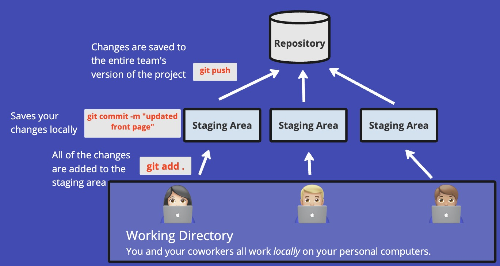

# Git Fundamentals 
## What is a repository?

{: .definition}
> Repositories are like digital libraries where all the files for a specific project are stored. It is the central hub where the creator of the repository (also known as a repo) can decide who can edit and view the files. In GitHub you can create as many repositories as you want and you will be able to control the structure and workflow you want for your project or organization. 

### Creating & Editing a New Repository
Everything that is done to create or edit a repository can be done on the site itself, or through your terminal! To learn how to create or edit one, see the following GitHub Documentation:
- [Creating a Repository](https://docs.github.com/en/repositories/creating-and-managing-repositories/quickstart-for-repositories?tool=cli)
- [Cloning a Repository](https://docs.github.com/en/repositories/creating-and-managing-repositories/cloning-a-repository)
- [Adding a File to a Repo](https://docs.github.com/en/repositories/working-with-files/managing-files/adding-a-file-to-a-repository)

## Understanding Git Areas and Commands

### Working Directory

The **working directory** is where you actively work on the files in your project. It contains all the changes you've made.

**Relevant Commands:**
- `git status`: Show the status of changes as untracked, modified, or staged.
- `git checkout`: Switch between branches or revert changes to files in your working directory.

### Staging Area

The **staging area**, or "index," is a holding area for changes that are ready to be committed. It's where you prepare and review changes before they are committed to the repository.

**Relevant Commands:**
- `git add`: Add changes from the working directory to the staging area.

### Repository

The **repository** is where Git stores the history of your project. It contains all of your commits, each of which is a snapshot of your project at a point in time.

**Relevant Commands:**
- `git commit`: Commit your staged changes to the repository.
- `git log`: View the commit history of the repository.
- `git push`: Upload your local repository content to a remote repository.

### Command Workflow

1. Make changes in the **working directory**.
2. Use `git add` to select and move these changes to the **staging area**.
3. With `git commit`, save the changes from the staging area to your **repository**.
4. If using a remote repository, like on GitHub, `git push` shares your commits from the local repository to the remote.

## What is a Branch?

A **branch** in Git encapsulates an independent line of development, enabling you to work on new features, bug fixes, or experiments separately from the main codebase. It's akin to creating a parallel universe where you can make changes without affecting the 'main' or 'master' branch until you're ready to merge those changes back in.

### Purpose of Branching

Branching serves several purposes:

- **Isolation**: Each branch isolates development work from other branches in the repository. This isolation enables you to work on different tasks simultaneously without impacting the stability of the main codebase.
- **Collaboration**: Teams can collaborate on a project more effectively by using branches. Each team member can work on a specific branch without causing conflicts with others' work.
- **Parallel Development**: Branches enable concurrent development of multiple features, which can later be integrated into the main branch for release.
- **Experimentation**: You can experiment with new ideas in a branch without the risk of destabilizing the codebase. If the experiment fails, you can discard the branch without any impact.

### How Branching Works

Creating a branch in Git is a fast and simple operation because it doesn't copy files to the branch—instead, Git just creates a new pointer. Here's how you can work with branches:

- **Create a New Branch**: `git branch <branch-name>`
- **Switch to a Branch**: `git checkout <branch-name>`
- **Merge a Branch**: To incorporate changes from one branch into another, you merge them. For example, you might merge a feature branch into the main branch once the feature is complete.
- **Delete a Branch**: Once you've merged the changes and no longer need the branch, you can delete it with `git branch -d <branch-name>`.

By using branches, you can manage the development of new features, fixes, and updates in a structured and organized manner, allowing for a smoother and more controlled workflow.

### References

  
Expand

    <b>1.</b> “About Repositories.” <i>GitHub Docs</i>, <a href="https://docs.github.com/en/repositories/creating-and-managing-repositories/about-repositories" target="_blank">docs.github.com/en/repositories/creating-and-managing-repositories/about-repositories</a>. Accessed 15 Apr. 2024. 
    <b>2.</b> “What Is a Git Repository?: Beginner Git Tutorial.” <i>GitKraken</i>, 17 Mar. 2023, <a href="https://www.gitkraken.com/learn/git/tutorials/what-is-a-git-repository" target="_blank">www.gitkraken.com/learn/git/tutorials/what-is-a-git-repository</a>. 
    <b>3.</b> Git Cheat Sheet, <a href="https://education.github.com/git-cheat-sheet-education.pdf" target="_blank">education.github.com/git-cheat-sheet-education.pdf</a>. Accessed 15 Apr. 2024. 
    <b>4.</b> “3.1 Git Branching - Branches in a Nutshell.” <i>Git</i>, <a href="https://git-scm.com/book/en/v2/Git-Branching-Branches-in-a-Nutshell" target="_blank">git-scm.com/book/en/v2/Git-Branching-Branches-in-a-Nutshell</a>. Accessed 15 Apr. 2024. 
    <b>5.</b> “Git & Github Tutorial for Beginners #8 - Branches.” <i>YouTube</i>, YouTube, 14 June 2017, <a href="https://www.youtube.com/watch?v=QV0kVNvkMxc" target="_blank">www.youtube.com/watch?v=QV0kVNvkMxc</a>. 

